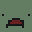

# Commands

| Command(Aliases) | Subcommand(Aliases) | Description | AdminMode Required | Command Actor  |
|--|--|--|--|--|
| /adminmode \<get/switch\> |  | Command to manage the admin mode. |  | <pre>
  
</pre> |
|  | - get [player] **(\<player\>)¹** | Command to get state of your or player's admin mode. |  | <pre>
  
</pre> |
|  | - switch [player] **(\<player\>)** | Command to turn on and off the admin mode. |  | <pre>
  
</pre> |
| /fly \<get/switch\> |  | Command to manage the fly modes. |  | <pre>
  
</pre> |
|  | - get [player] **(\<player\>)** | Command to get state of your or player's fly modes. |  | <pre>
  
</pre> |
|  | - switch [player] **(\<player\>)** | Command to turn on and off the fly mode. |  | <pre>
  
</pre> |
| /god \<get/switch\> |  | Command to manage the god modes. |  | <pre>
  
</pre> |
|  | - get [player] **(\<player\>)** | Command to turn on and off the god modes. |  | <pre>
  
</pre> |
|  | - switch [player] **(\<player\>)** | Command to get state of your or player's god modes. |  | <pre>
  
</pre> |
| /vanish \<get/switch\> |  | Command to manage the vanish. |  | <pre>
  
</pre> |
|  | - get [player] **(\<player\>)** | Command to get state of your or player's vanish. |  | <pre>
  
</pre> |
|  | - switch [player] **(\<player\>)** | Command to turn on and off the vanish. |  | <pre>
  
</pre> |
| /food [player] **(\<player\>)** |  | Command to update food for yourself and other players. |  | <pre>
  
</pre> |
| /heal [player] **(\<player\>)** |  | Command to heal yourself and other players. |  | <pre>
  
</pre> |
| /virus [player] **(\<player\>)** |  | Command to set virus for yourself and other players. |  | <pre>
  
</pre> |
| /water [player] **(\<player\>)** |  | Command to set water for yourself and other players. |  | <pre>
  
</pre> |
| /compass [North/South/East/West] |  | Command that shows direction you are facing or turn to face a specific direction |  | <pre>

</pre> |
| /position [player] **(\<player\>)** |  | Command that shows your or somebody's position. |  | <pre>
  
</pre> |
| /rotation [player] **(\<player\>)** |  | Command that shows your or somebody's rotation. |  | <pre>
  
</pre> |
| /tps |  | Command that shows TPS. |  | <pre>
  
</pre> |
| /annoucement \<message\> |  | Command to post annoucements. |  | <pre>
  
</pre> |
| /chat \<clear/enable/disable\> |  | Command to manage chat. |  | <pre>
  
</pre> |
|  | - clear | Command to clear chat. |  | <pre>
  
</pre> |
|  | - disable | Command to disable chat. |  | <pre>
  
</pre> |
|  | - enable | Command to enable chat. |  | <pre>
  
</pre> |
| /ascend(up) [distance] |  | Command that teleports you up. |  | <pre>

</pre> |
| /descend(down) [distance] |  | Command that teleports you down. |  | <pre>

</pre> |
| /jump(jmp) |  | Jump to where you're looking. |  | <pre>

</pre> |
| /gravity \<multipler\> [player] **(\<multipler\> \<player\>)** |  | Command to set gravity. |  | <pre>
  
</pre> |
| /jumpheight \<multipler\> [player] **(\<multipler\> \<player\>)** |  | Command to set jump height. |  | <pre>
  
</pre> |
| /speed \<multipler\> [player] **(\<multipler\> \<player\>)** |  | Command to set speed. |  | <pre>
  
</pre> |
| /teleport(tp) [player] \<player/place/marker\> **(\<player\> \<player/place\>)** |  | Command to teleport player to another player or place. |  | <pre>
  
</pre> |
| /experience(exp) \<get/add/set/take\> |  | Command to manage your or somebody's experience. |  | <pre>
  
</pre> |
|  | - add \<amount\> [player] **(\<amount\> \<player\>)** | Command to add your or somebody's experience. |  | <pre>
  
</pre> |
|  | - set \<amount\> [player] **(\<amount\> \<player\>)** | Command to set your or somebody's experience. |  | <pre>
  
</pre> |
|  | - take \<amount\> [player] **(\<amount\> \<player\>)** | Command to take your or somebody's experience. |  | <pre>
  
</pre> |
|  | - get [player] **(\<player\>)** | Command to get your or somebody's experience. |  | <pre>
  
</pre> |
| /maxskills [player] **(\<player\>)** |  | Command to max your or somebody's skills. |  | <pre>
  
</pre> |
| /reputation(rep) \<get/add/set/take\> |  | Command to manage your or somebody's reputation. |  | <pre>
  
</pre> |
|  | - add \<amount\> [player] **(\<amount\> \<player\>)** | Command to add your or somebody's reputation. |  | <pre>
  
</pre> |
|  | - set \<amount\> [player] **(\<amount\> \<player\>)** | Command to set your or somebody's reputation. |  | <pre>
  
</pre> |
|  | - take \<amount\> [player] **(\<amount\> \<player\>)** | Command to take your or somebody's reputation. |  | <pre>
  
</pre> |
|  | - get [player] **(\<player\>)** | Command to get your or somebody's reputation. |  | <pre>
  
</pre> |
| /clear \<items/vehicles/inventory\> **(\<inventory\>)** |  | Command to clear items, vehicles or inventories. |  | <pre>
  
</pre> |
|  | - inventory [player] **(\<player\>)** | Command to clear inventories. |  | <pre>
  
</pre> |
|  | - items \<distance\> | Command to clear items laying on the ground. |  | <pre>

</pre> |
|  | - vehicles \<distance\> [clearLocked] | Command to clear vehicles. |  | <pre>

</pre> |
| /destroy |  | Command to destroy object you're looking at. |  | <pre>

</pre> |
| /exit |  | Command to fast exit the server. |  | <pre>

</pre> |
| /item(i) \<item\> [amount] [player] **(\<item\> \<amount\> \<player\>)** |  | Command to give items. |  | <pre>
  
</pre> |
| /join \<ip/domain\> \<port\> [password] |  | Command to join another server. |  | <pre>
  
</pre> |
| /kill [player] **(\<player\>)** |  | Command to kill yourself or another player. |  | <pre>
  
</pre> |
| /more [amount] |  | Command to duplicate the item you are holding. |  | <pre>

</pre> |
| /open |  | Command to force open door, storage and vehicles. |  | <pre>

</pre> |
| /owner |  | Command to check owner of object you're looking at. |  | <pre>

</pre> |
| /refuel |  | Command to refuel the object you're looking at or current vehicle. |  | <pre>

</pre> |
| /repair |  | Command to repair the object you're looking at or current vehicle. |  | <pre>

</pre> |
| /requesturl \<url\> [player] [message] **(\<url\> \<player\> [message])** |  | Command to request player to open URL. |  | <pre>
  
</pre> |
| /respawn \<zombie/animals/vehicles\> |  | Command to respawn entities. |  | <pre>
  
</pre> |
|  | - animals(animal) | Command to respawn animals. |  | <pre>
  
</pre> |
|  | - zombies(zombie) | Command to respawn zombies. |  | <pre>
  
</pre> |
|  | - vehicles(vehicle) | Command to respawn vehicles. |  | <pre>
  
</pre> |
| /salvagespeed \<multipler\> [player] **(\<multipler\> \<player\>)** |  | Command to set speed of salvage. |  | <pre>
  
</pre> |
| /time \<get/set\> |  | Command to change or get overworld time. |  | <pre>
  
</pre> |
|  | - get | Command to get overworld time. |  | <pre>
  
</pre> |
|  | - set \<time\> | Command to set overworld time. |  | <pre>
  
</pre> |
| /tphere \<player\> |  | Command that teleports player to you. |  | <pre>
  
</pre> |
| /vehicle(i) \<vehicle\> [player] **(\<vehicle\> \<player\>)** |  | Command to spawn vehicles. |  | <pre>
  
</pre> |
| /weather \<set/disable\>|  | Command to change overworld weather. |  | <pre>
  
</pre> |
|  | - set \<sunny/storm/blizzard\> | Command to set overworld weather. |  | <pre>
  
</pre> |
|  | - disable | Command to disable overworld weather. |  | <pre>
  
</pre> |

¹ - syntax for the command called in the console
